<!-- README.md is generated from README.Rmd. Please edit that file -->

```{r, include = FALSE}
knitr::opts_chunk$set(
  collapse = TRUE,
  comment = "#>",
  fig.path = "man/figures/README-",
  out.width = "100%"
)
```

# Movenet
Movenet is a data digitalisation toolkit being developed by the [NordForsk DigiVet project](https://www.nordforsk.org/projects/digitalisation-livestock-data-improve-veterinary-public-health). It facilitates the dataflow from livestock movement data to social network analysis and disease transmission models, while addressing common data issues such as the diversity of data formats and privacy preservation.

We are also developing an accompanying interactive web app (temporarily housed [here](https://github.com/digivet-consortium/movenet_app)) to cater to users who may prefer a graphical user interface.

**Disclaimer:**
Movenet is under active development. The way functions are called, and the internal methods, may still change without prior warning.

## Workflows
Movenet facilitates a range of objectives and workflows pertaining to the processing and analysis of livestock movement data and (optional) holding data:
- standardisation into a single format, allowing for interoperability and integration of data from different countries or systems;
- pseudonymisation, and a range of options to make the data non-identifiable;
-	generation of networks, and (basic) social network analysis; 
-	integration of the data into transmission models;
-	exploration of the effects of different anonymisation options on outcomes of network analyses and transmission models, so as to allow users to find a suitable balance between the scale of anonymisation and the accuracy of these outcomes. 



## Reading in and reformatting data
A first step in any workflow is reading in livestock movement data (and optional holding data). At this stage, the challenge is the diversity of formats that movement and holding data can come in. Movenet addresses this by requiring users to provide a configuration file, indicating appropriate values for a range of factors that commonly vary between datasets, such as the separator and date format used, as well as headers of relevant columns. Example configuration files as well as an empty template are available in the `/inst/configurations` folder.  Using the appropriate configurations, data are read in and converted to a standardised Movenet format. This standardised format focuses on minimally required data (from, to, date, weight) but allows for additional columns; data types for specific columns are checked, and where possible converted to standards (e.g. R Date format) to improve interoperability. 


```{R, echo=FALSE, results=FALSE, message=FALSE}
# load the library using devtools
library(devtools)
devtools::load_all()
```

To read in and reformat some data, first we select a configuration. We do this using the `load_config(configfile)` function. For example, to load the configuration for ScotEID
data, we run:

```{R}
# The ScotEID configuration is loaded from ScotEID.yml into Movenet's environment.
load_config("ScotEID")
```

Next, we can use the
`reformat_data(datafile, type)` function to read and reformat the data.

```{R}
datafile <- "tests/testthat/test_input_files/sample_pigs_UK_with_dep_arr_dates.csv"
data <- reformat_data(datafile, "movement")
# Here we are using movement data, but we can also read and reformat holding
# data if we change the second parameter to "holding".
```

The reformatted data is returned as a tibble. The columns are in a standardised
order.

```{R}
# Look at the first six rows of the tibble
head(data)
```

## Making data non-identifiable
To address concerns around commercial sensitivity, Movenet includes a range of functions to make livestock movement data and/or holding data non-identifiable. It can pseudonymise holding identifiers:

```{R}
# Pseudonymise our data using the anonymise() function:
anonymised <- anonymise(data, "FARM")

data <- anonymised$data
anonymisation_key <- anonymised$key

# Now we can see the data has been pseudonymised:
head(data)

# And if desired, we can keep the anonymisation key to reverse this process later:
head(anonymisation_key)

# anonymise() also takes an optional `key` argument to use an existing key
```

It can also modify dates or weights by applying a small amount of noise or by rounding:

```{R}
# Use jitter to coarsen the dates
data <- data |> coarsen_date(
  jitter = 5, # add jitter of ±5 days
  rounding_unit = FALSE # do not round the data
)

# Use rounding to coarsen the weights
data <- data |> coarsen_weight(
  round = 10, # round weights to the nearest multiple of 10
  jitter = FALSE # do not jitter the data
)
```

A function to resample holding coordinates in a density-dependent manner is under development. The envisaged effect is to increase data sharing between different countries or organisations, which is of particular relevance when modelling transboundary disease spread.


## Generation of networks and (basic) social network analysis
Movenet uses the [Statnet suite of packages](https://statnet.org/packages/) (e.g. NetworkDynamic and tsna) for (temporal) social network analysis. We are currently working on functions in this section - e.g. creation of a pdf report with network measures of particular relevance to disease transmission.

Currently it is already possible to generate a NetworkDynamic and perform some
kinds of analysis:

```{R warning=FALSE}
# Create a NetworkDynamic from our data
smallData <- head(data, n=300) # use a subset of our data so this notebook knits faster
network <- movedata2networkDynamic(smallData)
network

# Perform some analysis - find the max reachability
parallel_max_reachabilities(list(network), n_threads=8)
```


## Integration of data into transmission models
Movenet links up with [SimInf](https://github.com/stewid/SimInf) for transmission modelling. We are currently working on functions in this section.

(A more extensive summary and usage/example code will be added shortly.)

