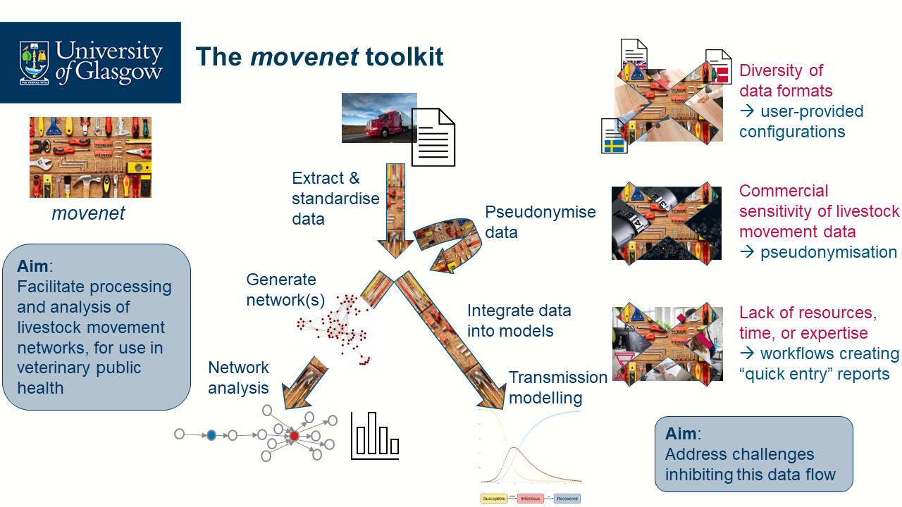

<!-- README.md is generated from README.Rmd. Please edit that file -->

# movenet

<!-- badges: start -->

<!-- [](https://github.com/digivet-consortium/movenet/actions/workflows/R-CMD-check.yaml) -->
<!-- badges: end -->

The goal of movenet is to simplify the effective use of livestock
movement data in veterinary public health. It facilitates the dataflow
from livestock movement data to social network analysis and disease
transmission models, while addressing common data issues such as the
diversity of data formats and privacy preservation.

<figure>

<figcaption aria-hidden="true">Flow chart showing the workflows of the
movenet package, as well as how movenet addresses some common data
challenges.</figcaption>
</figure>

movenet is being developed in the context of the [NordForsk
Digitalisation of livestock data to improve veterinary public health
(DigiVet)
project](https://www.nordforsk.org/projects/digitalisation-livestock-data-improve-veterinary-public-health).

**Disclaimer:** movenet is under active development. The way functions
are called, and the internal methods, may still change without prior
warning.

## Workflows

movenet includes a range of workflows for the processing and analysis of
livestock movement data and (optional) holding data:

- **standardisation** of data into a single format, allowing for
  interoperability and integration of data from different countries or
  systems

- **pseudonymisation** of livestock movement and/or holding data, to
  improve the potential for data sharing and collaborative analysis

- generation of network representations, and **social network
  analysis**, of livestock movement data

- integration of livestock movement and/or holding data into
  **transmission models**

- exploration of the effects of different pseudonymisation strategies on
  network properties, so as to allow users to find a suitable balance
  between the identifiability of the data and the accuracy of these
  properties.

For more detail on each of these workflows, including sample code, see
the vignettes.

## Shiny app

In addition to the basic functions in the movenet package, we are
developing an accompanying Shiny app to cater to users who prefer a
graphical user interface. For further information on the movenet app,
see its [GitHub
repository](https://github.com/digivet-consortium/movenetapp).

## Installation

You can install the development version of movenet from
[GitHub](https://github.com/) with:

``` r
# install.packages("devtools")
devtools::install_github("digivet-consortium/movenet")
```

## Usage

To get started with movenet, first load a config file to tell movenet
how to read your data, and then read in a data file:

``` r
library(movenet)

# Load an example movement config file:
load_config(system.file("configurations", "ScotEID.yml", package = "movenet"))
#> Successfully loaded config file: C:/Users/cboga/OneDrive - University of Glasgow/Documents/R/win-library/4.1/movenet/configurations/ScotEID.yml
# Read in and reformat an example movement data file:
movement_data <- 
  reformat_data(system.file("extdata", "example_movement_data.csv", package = "movenet"),
                type = "movement")

# Load an example holding config file:
load_config(system.file("configurations", "fakeScotEID_holding.yml", package = "movenet")) 
#> Successfully loaded config file: C:/Users/cboga/OneDrive - University of Glasgow/Documents/R/win-library/4.1/movenet/configurations/fakeScotEID_holding.yml
# Read in and reformat an example holding data file:
holding_data <- 
  reformat_data(system.file("extdata", "example_holding_data.csv", package = "movenet"),
                type = "holding")
```

The movement and holding data are now in the right format
(movenet-format data tibbles) to be plugged into pseudonymisation,
network analysis, and transmission modelling workflows. See
`vignette("movenet")` for more details on these data
reading/reformatting steps, and the other vignettes for more information
on the various workflows.
